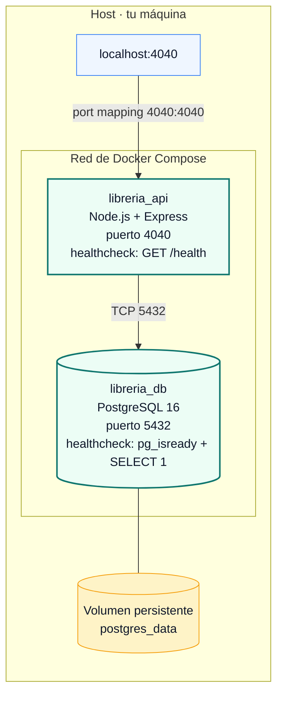

El proyecto está empaquetado con **Docker Compose** y se levanta con un único comando. Esta página documenta la configuración real definida en [docker-compose.yml](Practica_Con_Mintlify/docker-compose.yml) y el [Dockerfile](Practica_Con_Mintlify/Dockerfile) de la API.

## Topología



## Servicios

### `db` — PostgreSQL 16

<ResponseField name="image" type="string">
  `postgres:16-alpine` — imagen oficial ligera.
</ResponseField>

<ResponseField name="container_name" type="string">
  `libreria_db` — nombre fijo para que sea fácil acceder con `docker exec`.
</ResponseField>

<ResponseField name="volumes" type="array">
  `postgres_data:/var/lib/postgresql/data` — los datos viven en un volumen Docker persistente. **No** se borran con `docker compose down`; **sí** con `docker compose down -v`.
</ResponseField>

<ResponseField name="healthcheck" type="object">
  Ejecuta dos checks combinados: `pg_isready` confirma que el proceso aceptaría conexiones, y `psql -c 'SELECT 1'` confirma que realmente puede ejecutar queries sobre la base `libreria`. Solo cuando ambos pasan, el servicio se marca como `healthy`.

  - `interval: 5s` — frecuencia entre intentos
  - `timeout: 5s` — máximo por intento
  - `retries: 20` — número de intentos antes de marcar como `unhealthy`
  - `start_period: 15s` — tiempo de gracia durante `initdb` (los fallos no cuentan como retries)
</ResponseField>

### `api` — Node.js + Express

<ResponseField name="build" type="object">
  Construye desde el `Dockerfile` local (no usa una imagen pre-publicada).
</ResponseField>

<ResponseField name="container_name" type="string">
  `libreria_api`.
</ResponseField>

<ResponseField name="ports" type="array">
  `4040:4040` — el puerto del contenedor (4040, que la API escucha vía `process.env.PORT`) se mapea al mismo puerto del host. Por eso accedes desde tu navegador a `http://localhost:4040`.
</ResponseField>

<ResponseField name="depends_on" type="object">
  `db: { condition: service_healthy }` — la API **no** arranca hasta que el healthcheck de `db` esté pasando. Esto evita el clásico race condition de Sequelize intentando conectarse antes de que Postgres esté listo.
</ResponseField>

<ResponseField name="healthcheck" type="object">
  Hace `GET http://127.0.0.1:4040/health` usando `node -e` (sin dependencias extra como `curl` o `wget`). Útil para que `docker compose ps` te diga si la API ya está aceptando tráfico.

  - `start_period: 20s` — cubre el tiempo del `sequelize.sync()` inicial y el seed.
</ResponseField>

## Puertos

| Servicio  | Puerto interno (contenedor) | Puerto host | Accesible desde                                |
| --------- | --------------------------- | ----------- | ---------------------------------------------- |
| `api`     | `4040`                      | `4040`      | Tu navegador / clientes externos.              |
| `db`      | `5432`                      | (sin mapeo) | Solo otros servicios de la misma red Compose.  |

<Note>
  El puerto `5432` de Postgres **no está expuesto al host** por defecto. Si necesitas conectar un cliente SQL desde fuera del contenedor (DBeaver, psql local), añade `ports: ["5432:5432"]` al servicio `db`.
</Note>

## Variables de entorno

Las variables se definen tanto en `docker-compose.yml` (valores efectivos en contenedor) como en `.env` / `.env.example` (referencia y desarrollo local fuera de Docker).

### Servicio `api`

| Variable      | Valor en Compose | Lectura en código                          | Descripción                                  |
| ------------- | ---------------- | ------------------------------------------ | -------------------------------------------- |
| `PORT`        | `4040`           | [src/index.js:37](Practica_Con_Mintlify/src/index.js#L37) | Puerto HTTP de Express.       |
| `DB_HOST`     | `db`             | [src/config/database.js](Practica_Con_Mintlify/src/config/database.js) | Hostname del contenedor de Postgres dentro de la red Compose. |
| `DB_PORT`     | `5432`           | idem                                       | Puerto interno de Postgres.                  |
| `DB_USER`     | `postgres`       | idem                                       | Usuario.                                     |
| `DB_PASSWORD` | `postgres`       | idem                                       | Contraseña.                                  |
| `DB_NAME`     | `libreria`       | idem                                       | Nombre de la base de datos.                  |

### Servicio `db`

| Variable            | Valor       | Descripción                                                       |
| ------------------- | ----------- | ----------------------------------------------------------------- |
| `POSTGRES_DB`       | `libreria`  | Base creada por la imagen oficial en el primer arranque.          |
| `POSTGRES_USER`     | `postgres`  | Usuario superadmin.                                               |
| `POSTGRES_PASSWORD` | `postgres`  | Contraseña del usuario.                                           |

<Warning>
  Las credenciales `postgres / postgres` son **solo para desarrollo**. En producción, sobrescríbelas con secretos del entorno (Docker secrets, variables del orquestador, vault, etc.) y rota la contraseña antes de exponer la base.
</Warning>

## Volúmenes

| Nombre          | Mount point dentro del contenedor   | Servicio | Persistencia                                  |
| --------------- | ----------------------------------- | -------- | --------------------------------------------- |
| `postgres_data` | `/var/lib/postgresql/data`          | `db`     | Sobrevive a `down`; se borra con `down -v`.   |

<Tip>
  Si quieres "empezar de cero" (perder todos los datos y forzar el seed inicial), corre `docker compose down -v && docker compose up --build`.
</Tip>

## Cómo arranca todo (orden de eventos)

1. `docker compose up --build` levanta `db` y `api` en paralelo.
2. `db` ejecuta `initdb`, crea la base `libreria`, el usuario `postgres` y aplica la contraseña.
3. El healthcheck del `db` empieza a correr cada 5s. Hasta que `pg_isready` + `SELECT 1` pasen, marca como `starting` / luego `healthy`.
4. Como `api` depende de `db` con `condition: service_healthy`, **espera** a que el healthcheck del `db` pase.
5. Cuando arranca, el `api`:
   - Ejecuta `sequelize.authenticate()` (verifica conexión).
   - Ejecuta `sequelize.sync({ alter: true })` (crea/ajusta tablas).
   - Ejecuta `runSeedIfEmpty()` (carga datos solo si las tablas están vacías).
   - Llama a `app.listen(4040)`.
6. El healthcheck del `api` (GET /health) comienza a pasar → `docker compose ps` lo marca como `healthy`.

<Note>
  Las **tablas** las crea la API misma, no Postgres. Postgres solo aporta la base vacía. Por eso el `depends_on` es sobre `db` saludable, no sobre tablas existentes — sería un deadlock pedirle a la API que espere por algo que ella misma crea.
</Note>

## Comandos útiles

<AccordionGroup>
  <Accordion icon="play" title="Levantar todo">
    ```bash
    docker compose up --build
    ```
    Con `--build` fuerza rebuild de la imagen `api` (necesario si tocaste `package.json` o `src/`).
  </Accordion>

  <Accordion icon="circle-stop" title="Detener todo (conservar datos)">
    ```bash
    docker compose down
    ```
    El volumen `postgres_data` permanece — al volver a levantar, la base sigue como estaba.
  </Accordion>

  <Accordion icon="broom" title="Detener y borrar la base">
    ```bash
    docker compose down -v
    ```
    Borra el volumen → próximo arranque crea la base desde cero y vuelve a correr el seed.
  </Accordion>

  <Accordion icon="terminal" title="Logs solo de la API">
    ```bash
    docker compose logs -f api
    ```
  </Accordion>

  <Accordion icon="terminal" title="Logs solo de la base">
    ```bash
    docker compose logs -f db
    ```
  </Accordion>

  <Accordion icon="database" title="Abrir psql dentro del contenedor de la base">
    ```bash
    docker compose exec db psql -U postgres -d libreria
    ```
  </Accordion>

  <Accordion icon="heart-pulse" title="Estado de healthchecks">
    ```bash
    docker compose ps
    ```
    Verás columnas `STATUS` con `healthy` / `unhealthy` / `starting`.
  </Accordion>

  <Accordion icon="rotate-right" title="Rebuild forzado de la API">
    ```bash
    docker compose build --no-cache api
    docker compose up
    ```
  </Accordion>
</AccordionGroup>

## Dockerfile de la API

El [Dockerfile](Practica_Con_Mintlify/Dockerfile) es minimalista:

```dockerfile
FROM node:20-alpine
WORKDIR /app
COPY package*.json ./
RUN npm ci --omit=dev
COPY src ./src
EXPOSE 4040
CMD ["npm", "start"]
```

Decisiones a destacar:

- **`node:20-alpine`** — imagen pequeña (~50 MB), suficiente para Express + Sequelize.
- **`COPY package*.json` antes que `COPY src`** — aprovecha el cache de capas: si solo cambia el código, no reinstala `node_modules`.
- **`npm ci --omit=dev`** — instala desde `package-lock.json` (reproducible) y omite `nodemon` y otras `devDependencies`.
- **`EXPOSE 4040`** — documentativo; el mapeo real al host lo hace `docker-compose.yml`.

<Tip>
  Para entornos de producción reales, considera un build multi-stage que copie solo lo necesario y agregue un usuario no-root (`USER node`).
</Tip>
