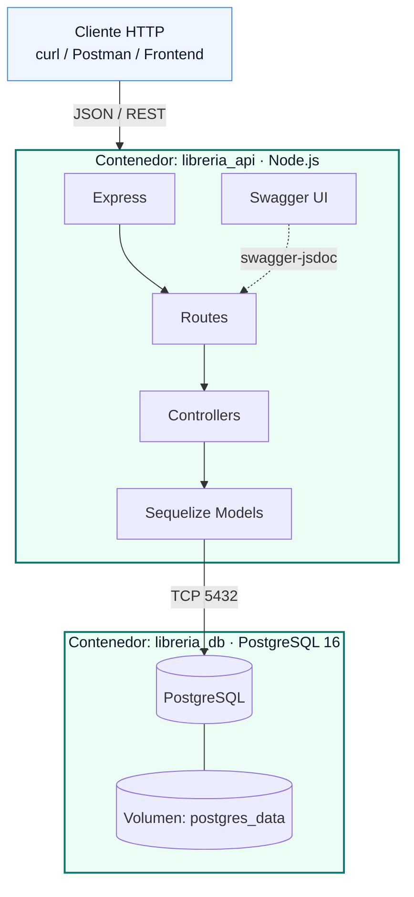

# Librería API

**Librería API** es un servicio REST que expone operaciones CRUD sobre dos entidades de dominio:

- **Autores**: personas que escriben libros.
- **Libros**: obras catalogadas, cada una asociada a un autor mediante `autor_id`.

El proyecto está pensado como base para practicar buenas prácticas de documentación con [Mintlify](https://mintlify.com) sobre una API ya productiva, dockerizada y con OpenAPI/Swagger.

<Card title="Base URL" icon="globe">
  `http://localhost:4040`
</Card>

## Stack tecnológico

<CardGroup cols={2}>
  <Card title="Node.js + Express" icon="node-js">
    Runtime de JavaScript y framework HTTP minimalista para definir las rutas REST.
  </Card>
  <Card title="Sequelize ORM" icon="database">
    Mapea los modelos `Autor` y `Libro` a tablas de PostgreSQL y maneja las migraciones/seeds.
  </Card>
  <Card title="Docker + Docker Compose" icon="docker">
    Orquesta dos servicios: la API Node.js y la base de datos PostgreSQL 16.
  </Card>
  <Card title="Swagger / OpenAPI" icon="book">
    Especificación interactiva publicada en `/api-docs` y JSON crudo en `/api-docs.json`.
  </Card>
</CardGroup>

## Arquitectura

El sistema sigue una arquitectura clásica en capas, contenedorizada con Docker Compose:



### Capas dentro de la API

- **Routes** (`src/routes`): definen los endpoints HTTP de `/autores` y `/libros`.
- **Controllers** (`src/controllers`): contienen la lógica de cada operación.
- **Models** (`src/models`): entidades Sequelize (`Autor`, `Libro`) con su relación 1:N.
- **Config** (`src/config`): inicialización de Sequelize, seed y especificación Swagger.

## Endpoints destacados

| Método | Ruta            | Descripción                                       |
| ------ | --------------- | ------------------------------------------------- |
| GET    | `/health`       | Healthcheck del servicio.                         |
| ANY    | `/autores`      | Operaciones CRUD sobre autores.                   |
| ANY    | `/libros`       | Operaciones CRUD sobre libros.                    |
| GET    | `/api-docs`     | Swagger UI interactivo.                           |
| GET    | `/api-docs.json`| Especificación OpenAPI en JSON.                   |

## Respuesta estándar

Todas las respuestas siguen un formato consistente.

```json
{
  "success": true,
  "data": {}
}
```

En caso de error:

```json
{
  "success": false,
  "error": {
    "code": "ERROR_CODE",
    "message": "Mensaje descriptivo"
  }
}
```

<Note>
  Continúa en la sección [Quickstart](/quickstart) para levantar el proyecto en local con Docker Compose.
</Note>
