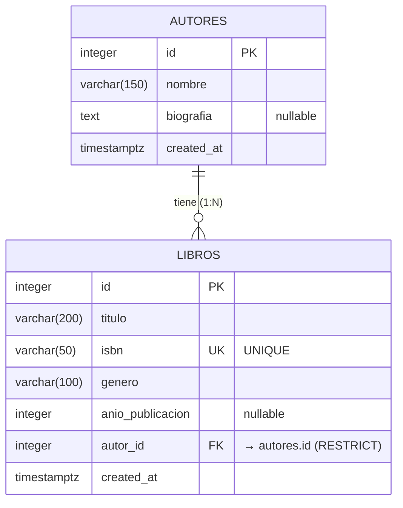

La capa de persistencia usa **Sequelize 6** sobre PostgreSQL 16. Los modelos viven en [src/models/](Practica_Con_Mintlify/src/models/) y se registran en [src/config/database.js](Practica_Con_Mintlify/src/config/database.js).

<Note>
  Ambos modelos tienen `timestamps: false` y exponen un único campo de fecha gestionado a mano: `created_at`. **No hay** `updated_at` ni `deleted_at`.
</Note>

## Diagrama Entidad-Relación



## Autor

Definido en [src/models/autor.model.js](Practica_Con_Mintlify/src/models/autor.model.js). Tabla SQL: `autores`.

<ResponseField name="id" type="INTEGER (PK, autoincrement)" required>
  Identificador único. Generado por la base de datos.
</ResponseField>

<ResponseField name="nombre" type="STRING(150)" required>
  Nombre completo del autor. **`allowNull: false`** — obligatorio. El controller además rechaza strings vacíos o con solo espacios (`INVALID_BODY`).
</ResponseField>

<ResponseField name="biografia" type="TEXT">
  Biografía libre. **`allowNull: true`** — opcional. Si no se envía en el POST/PUT, se guarda como `null`.
</ResponseField>

<ResponseField name="created_at" type="DATE (ISO 8601)" required>
  Fecha de creación. Default `NOW()` asignado por Sequelize al insertar.
</ResponseField>

### Esquema compacto

| Campo         | Tipo SQL          | Null | Default     | Notas                                |
| ------------- | ----------------- | ---- | ----------- | ------------------------------------ |
| `id`          | `INTEGER`         | NO   | `nextval()` | Primary Key, autoincremental.        |
| `nombre`      | `VARCHAR(150)`    | NO   | —           | Obligatorio en POST/PUT.             |
| `biografia`   | `TEXT`            | SÍ   | `NULL`      | Opcional.                            |
| `created_at`  | `TIMESTAMPTZ`     | NO   | `NOW()`     | Asignado por Sequelize.              |

## Libro

Definido en [src/models/libro.model.js](Practica_Con_Mintlify/src/models/libro.model.js). Tabla SQL: `libros`.

<ResponseField name="id" type="INTEGER (PK, autoincrement)" required>
  Identificador único.
</ResponseField>

<ResponseField name="titulo" type="STRING(200)" required>
  Título del libro. `allowNull: false`.
</ResponseField>

<ResponseField name="isbn" type="STRING(50) UNIQUE" required>
  ISBN del libro. `allowNull: false` y **`unique: true`** — si se intenta insertar/actualizar con un ISBN ya existente, la API responde `400 ISBN_DUPLICATE`.
</ResponseField>

<ResponseField name="genero" type="STRING(100)" required>
  Género literario. `allowNull: false`. El filtro `GET /libros?genero=...` aplica `ILIKE` (case-insensitive, match exacto).
</ResponseField>

<ResponseField name="anio_publicacion" type="INTEGER">
  Año de publicación. `allowNull: true` — opcional.
</ResponseField>

<ResponseField name="autor_id" type="INTEGER (FK)" required>
  FK a `autores.id`. `allowNull: false`. Si el `autor_id` enviado no existe, la API responde `400 AUTOR_NOT_FOUND`.
</ResponseField>

<ResponseField name="created_at" type="DATE (ISO 8601)" required>
  Fecha de creación. Default `NOW()`.
</ResponseField>

### Esquema compacto

| Campo               | Tipo SQL          | Null | Constraint              | Notas                                |
| ------------------- | ----------------- | ---- | ----------------------- | ------------------------------------ |
| `id`                | `INTEGER`         | NO   | PK autoincremental      | Generado por la base.                |
| `titulo`            | `VARCHAR(200)`    | NO   | —                       | Obligatorio.                         |
| `isbn`              | `VARCHAR(50)`     | NO   | **UNIQUE**              | Falla: `ISBN_DUPLICATE`.             |
| `genero`            | `VARCHAR(100)`    | NO   | —                       | Filtrable case-insensitive.          |
| `anio_publicacion`  | `INTEGER`         | SÍ   | —                       | Opcional.                            |
| `autor_id`          | `INTEGER`         | NO   | **FK → autores.id**     | RESTRICT on delete, CASCADE on update. |
| `created_at`        | `TIMESTAMPTZ`     | NO   | DEFAULT `NOW()`         |                                      |

## Relación Autor ↔ Libro

Definida en [src/config/database.js](Practica_Con_Mintlify/src/config/database.js):

```js
Autor.hasMany(Libro, {
  foreignKey: "autor_id",
  as: "libros",
  onDelete: "RESTRICT",
  onUpdate: "CASCADE",
});

Libro.belongsTo(Autor, {
  foreignKey: "autor_id",
  as: "autor",
});
```

**Cardinalidad:** un autor tiene **muchos** libros; un libro pertenece a **un único** autor.

### Reglas de integridad referencial

| Operación                                     | Comportamiento                                                                                |
| --------------------------------------------- | --------------------------------------------------------------------------------------------- |
| Crear libro con `autor_id` inexistente        | Falla con `400 AUTOR_NOT_FOUND` (Sequelize: `SequelizeForeignKeyConstraintError`).            |
| Actualizar libro reasignando a `autor_id` inexistente | Falla con `400 AUTOR_NOT_FOUND`.                                                      |
| Eliminar autor que tiene libros               | Falla con `400 AUTOR_HAS_BOOKS` (la FK `RESTRICT` bloquea el DELETE).                         |
| Actualizar `id` de autor (no hay endpoint)    | N/A — el `id` no es editable vía API.                                                         |
| Eliminar libro                                | Permitido siempre; no afecta al autor.                                                        |

### Alias usados en los includes

Los controllers de libros aplican `include` con el alias `autor`:

```js
include: [
  { model: Autor, as: "autor", attributes: ["id", "nombre"] }
]
```

Por eso `GET /libros` y `GET /libros/{id}` devuelven un objeto anidado `autor: { id, nombre }` además de `autor_id`. Los endpoints `POST /libros` y `PUT /libros/{id}` **no** aplican este include, así que retornan solo el campo `autor_id` sin objeto anidado.

## Inicialización del esquema

La API ejecuta `sequelize.sync({ alter: true })` al arrancar ([initDatabase](Practica_Con_Mintlify/src/config/database.js#L32)). Esto crea las tablas si no existen y ajusta columnas si cambiaron. No hay migraciones manuales.

<Warning>
  `sync({ alter: true })` es cómodo para desarrollo pero no debe usarse así en producción — puede ejecutar `ALTER`s destructivos. Para producción, migrar a `sequelize-cli` o `umzug` con migraciones versionadas.
</Warning>

## Seeds

Al arrancar, se ejecuta [src/config/seed.js](Practica_Con_Mintlify/src/config/seed.js) solo si las tablas están vacías. Carga un set inicial de autores y libros de prueba (Gabriel García Márquez, Isaac Asimov, etc.).

Para forzar una reinicialización completa (incluido el reseed):

```bash
docker compose down -v
docker compose up --build
```
